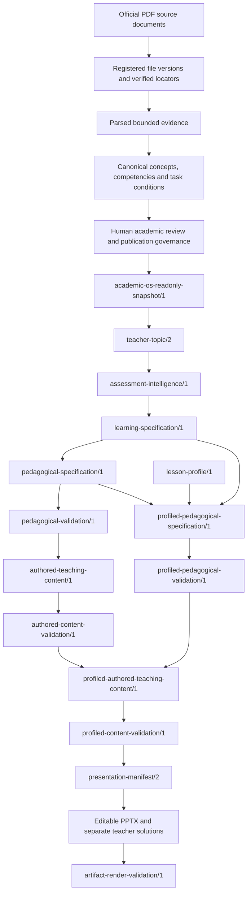

# Standard Deviation Vertical Slice v1

**Classification:** Pre-AI Reference Implementation. **Status:** Frozen baseline.

This is the first deeply developed topic reference, not a claim that Academic OS
is production complete. The freeze records existing behavior and artifacts. It
does not approve content, publish a snapshot, install a runtime hash lock, or
replace current validation. The exact capture timestamp, file hashes, contract
inventory and database baseline live in
[`reference_manifest.json`](../output/reference_freeze/reference_manifest.json).
[`acceptance.json`](../output/reference_freeze/acceptance.json) records before/after
integrity and exact executed test results, including any historical errors.

## Lineage and reasons for separation

This graph describes dependencies, not permission to promote data. Source identity,
academic approval, pedagogical adequacy, mathematical correctness and faithful
rendering are different checks. Passing one does not imply the others.

### Evidence and trusted foundation (P0–P1C.1)

The original source file is registered with an explicit identity, path and SHA-256.
Locators bind a source version, PDF page and controlled extracted wording back to
the original page. Registration, extraction, locator verification and academic
interpretation approval are separate states. Neither a filename nor a matching
file hash proves an interpretation correct. Layout-defective extracted symbols
remain recorded as such; source registration does not authorize silent repair.

Canonical concepts state meaning, competencies state what can be done, and task
conditions delimit the form in which that capability is evidenced. Question-specific
context does not become a reusable canonical competency merely because it occurs
in a marking scheme. Reviewed mappings bind content and dependency versions.
Changing a competency or a dependent evidence/locator/source/context/scope version
invalidates the matching old review for new publication.

The SQLite journal preserves object versions, operator review events, request
idempotency, superseding/revocation relationships and publication membership.
The publication gate checks references, current source verification, academic
reviews and dependency closure. Immutable snapshot payloads remain historical
records even when current status blocks their use.

`academic-os-readonly-snapshot/1` is the actual payload `format` value (not a
fabricated `trusted-snapshot` schema). Current reads must use `Service.snapshot`.
It can append withdrawal blocks, so this freeze uses the existing
`product_reader.read_usable_snapshots`: a read-only SQLite connection is backed up
to disposable memory and the unchanged service runs there, checking real source
files. Thus even a failed check cannot write a new block to the real database.

Human authority covers source/locator verification and academic interpretation
approval. Implemented defer/reopen governance is a separate publication-scope
decision bound to the unresolved proposal and target versions. Deferral is not
approval. Reopening or changing dependencies can block an old snapshot without
rewriting its bytes. The current database has one governance decision; the freeze
does not create another. Historical phase documents describe their state at the
time and must not be read as current snapshot-status assertions.

The current operator boundary is the local CLI and OS account. Reviewer labels
inside candidate JSON are not trusted credentials. This is not production identity
authentication. Future teacher editing or pedagogical preferences would be a
different authority from academic review and could not silently change canonical
truth or published scope.

## Contract responsibilities

All derived builders and validators below are deterministic for their bounded
supported inputs. No current service authoring slot calls an LLM. Every derived
layer has **no trusted-state write permission**. Human-reviewed upstream evidence
does not mean humans individually approved its generated teaching prose or layout.
The governed snapshot creator is the only publication operation represented here;
it is not invoked by this freeze. Versions are read from implementation and existing
payloads, with file-level bindings in the reference manifest.

| Contract | Inputs → outputs / downstream consumers | Purpose and protected boundary |
| --- | --- | --- |
| `academic-os-readonly-snapshot/1` | Versioned sources, evidence, semantic objects, human reviews and governance → immutable closure consumed by product service | Reviewed academic assertions within their bounded scope; current usability must still be checked. Human decisions are authoritative, not generated. |
| `teacher-topic/2` | Usable Q2/Q3 snapshots → teacher meaning, capabilities, curriculum wording and observed examples; consumed by intelligence | Separates product navigation/wording from canonical identity. Verified syllabus wording remains a candidate association where equivalence is not established. |
| `assessment-intelligence/1` | Current teacher topic → supported assessment observations and limitations; consumed by learning service | Reports evidence seen in reviewed examples without converting it into frequency, typical marks or difficulty. |
| `learning-specification/1` | Current intelligence/product knowledge → learning and coverage requirements, evidence boundaries; consumed by pedagogy/content validators | Makes supported learning scope explicit without adding a new canonical competency or inferring missing task forms. |
| `pedagogical-specification/1` | Learning specification → teaching-block, assessment and authoring constraints; consumed by pedagogical validation | Proposes a deterministic teaching structure. It is pedagogical design, not academic truth. |
| `pedagogical-validation/1` | Candidate pedagogy plus current learning contract → violations and authoring readiness; consumed by authored service | Independently checks contract alignment and completeness; does not grant academic approval. |
| `authored-teaching-content/1` | Validated pedagogy and learning scope → original explanations, examples, questions, formulas and separate solutions; consumed by content validation | Bounded deterministic authoring supplies teaching candidates. It does not copy an exam identity onto generated examples. |
| `authored-content-validation/1` | Actual authored content and current upstream contracts → mathematical, content, alignment and boundary results; consumed by reuse/renderer | Recomputes correctness and gates rendering instead of trusting stored verification claims. |
| `lesson-profile/1` | Explicit product configuration → purpose, duration ranges, minimum/target densities and support policies; consumed by profiled pedagogy | Defines lesson format, not learner ability, academic difficulty, measured runtime or slide count. |
| `profiled-pedagogical-specification/1` | Base pedagogy, learning specification and lesson profile → ordered roles with scope fingerprint; consumed by profile validation and P5B | Changes pedagogical density while preserving learning scope and canonical meaning. |
| `profiled-pedagogical-validation/1` | Profiled roles plus current base/profile/learning inputs → role, density and scope validation | P5A compatibility gate; not academic review and not authored-content verification. |
| `profiled-authored-teaching-content/1` | Current compatible P4A/P4B content plus profiled roles → reuse/new/unresolved decisions and referenced content; consumed by P5C | Reuses original identities first and authors only supported density gaps. P5B's frozen renderer-ready field remains false. |
| `profiled-content-validation/1` | Actual composition plus current contracts → independent role, density, reuse, mathematics, scope and rendering-readiness report; consumed by P5D | Separates minimum compliance from preferred targets and rejects unresolved required roles. |
| `presentation-manifest/1`, `presentation-manifest/2` | Validated content → slide/content/visibility/layout mappings; consumed by editable renderer | v1 is preserved P4C/P4C.1. v2 adds profile/role mappings and P5C bindings explicitly, without changing v1 meaning. |
| `artifact-render-validation/1` | Actual finalized PPTX plus freshly resolved expected layout → preservation/visibility/geometry results | Checks what was rendered, rather than treating manifest declarations as proof of output correctness. |

Teacher solutions use `presentation-teacher-solutions/1` in P4C and `/2` in P5D.
The second is profile-keyed and retains original solution objects and role/item
references. It is not student-facing content. Legacy `teacher-topic/1` artifacts
are retained and inventoried but are not the current service contract.

## Trust-boundary matrix

| Layer | Academic truth? | Human reviewed? | AI currently allowed to decide/author? | Trusted-state mutation? | Student rendering? |
| --- | --- | --- | --- | --- | --- |
| Registered file / extracted locator | Evidence, not approved interpretation | Only when operator verification exists | No | Operator-governed registration/verification only | Indirect, bounded references |
| Trusted snapshot | Reviewed assertions within approved scope, subject to current usability | Academic and source reviews plus applicable governance | No | Governed service publication/status operations; payload immutable | Indirect through current service |
| Teacher topic / intelligence | Derived meaning and observations, not new truth | Upstream reviews only | No | No | Only selected product meaning, not internal trust machinery |
| Learning specification | Evidence-backed learning requirements, not new canonical truth | Upstream reviews; no new academic decision | No | No | Goals via renderer's existing transformation |
| Pedagogical / profiled specifications | Pedagogical candidates | No independent academic approval of design | No | No | Through validated content |
| Lesson profile | Product policy, not academic truth | User-specified configuration, not academic review | No | No | Planning labels only |
| Authored / profiled content | Teaching candidates | Upstream authority is not content approval | No | No | Only after applicable current gates |
| Validation reports | Bounded verification results, not truth by declaration | Deterministic checks, not reviewer receipts | No | No | Technical reports stay outside student deck |
| Manifest / PPTX | Presentation of validated inputs | No new academic approval | No | No | Student-selected regions only; answers separated |
| Reference freeze | Engineering baseline only | No approval created | No | No | Not a teaching artifact or runtime authority |

## Frozen academic scope and evidence

The three existing Learning Requirements are:

1. Understand what standard deviation represents —
   `lr-7b24768b44575af081543583a29961215b0c945e9d4ca66bc5ae5286eba58928`.
2. Calculate standard deviation —
   `lr-df03d404c2eba08674287ef118ab8a58ee05db8a84040e73b398178d9296e20a`.
3. Calculate standard deviation from supplied summary statistics —
   `lr-e8285523a4501ff2925f689c15582befdbd161a4b6d53364199f6eedc94c7b0b`.

The reviewed examples are June 2025 **9MA0/31 Q2(b)** and June 2023
**9MA0/31 Q3(b)(ii)**. Both support the current calculation capability under
`task-form-summary-statistics`. Each recorded subpart has two observed marks;
this is an observation about those subparts, not a typical-mark claim. Extraction
warnings remain available, including damaged formula glyphs and grouped marks.
The exact evidence, two coverage requirements and boundaries are in the manifest.

This scope does not establish sample SD / n−1, all possible SD task forms,
difficulty, frequency, typical marks, common student mistakes, formal prerequisites,
future exam predictions, required formula memorisation or a specific calculator
procedure. The small raw-data worked example is instructional modelling of the
general calculation capability, not a newly supported assessed task form.

Protected snapshot IDs, checked through the current service at capture and acceptance:

- Q2: `04765fa526fc03ee889f8e0691a23e07de4dcbd5486a779317a928c0809a7070`
- Q3: `4c48326cc3b4e3315118d8dc675764a1cff2d8e0c7d37a2f741bc26d928fe826`

Both current profiles share academic scope fingerprint
`e53e60013e254a631d64f69a71bcaad5df19242f913fdbe3b9644c8f0031e359`.

## Profiles, reuse and rendering

Focused Review targets **25 minutes**, with an acceptable planning range of
**20–30 minutes**. Its nine substantive roles all reuse validated content; zero
new items are authored. Standard Lesson targets **60 minutes**, range **50–60**.
Its 15 roles include orientation framing and 14 substantive role decisions:
seven reuse and seven author-new. Nine existing content blocks remain reused;
seven new items fill density gaps, six of them numerical. The composite independent
practice role includes two reused items and one new item. These counts are verified
against actual P5B/P5D acceptance artifacts, not inferred from lesson duration.

P5B resolves each role as REUSE, AUTHOR_NEW or UNRESOLVED. Reuse binds original
content and dependency hashes plus current P4B validation. New content does not
gain trusted academic status. A required unresolved role blocks P5C readiness.

Minimum and target are separate. Standard Lesson independent practice has minimum
two and preferred target three. Tested Case C removes the third question, its
solution and mapping coherently: two valid items meet minimum, target is not met,
a warning remains, and rendering is possible absent other blockers. Current
`lesson-profile/1` has no separate mandatory-target flag; unknown policy fields
fail closed. Targets equal to minimum are necessarily hard requirements.

The existing P5D artifacts have **11 slides** (Focused Review) and **19 slides**
(Standard Lesson). These are rendering outputs, not profile requirements.
P5D checks live P5C readiness and matching scope before rendering. It may group or
split slides, select layout, hierarchy, labels, working space and formula placement.
It must not create explanations, examples, questions, answers, learning requirements,
task forms or assessment claims. P4C.1 components preserve the same concept visual
datasets, formulas and reused question/solution objects. Guided scaffolds come
from P5B; independent practice leaves open working space. Teacher solutions remain
separate. Actual PPTX text/shape validation rejects inserted answers or changed
numbers rather than relying solely on visibility metadata.

## Mathematical trust

`authored_math.py` uses bounded rational/decimal computations and formula-AST
checks. It recomputes means, population variances and SD from raw values or summary
statistics, checks finite values and non-negative implied variance, exact radicands,
numeric tolerance and rounding. P5B adapts those primitives for the raw example
and new cases; P5C recomputes all six new numerical items. A stored answer or
`verified` flag never substitutes for the computation. This is not a general CAS
or an arbitrary natural-language proof system.

## Pre-AI permission boundary

LLM authoring in this current vertical-slice production service path: **NONE**.
Legacy scripts elsewhere in the repository are not a grant of authority to this
chain. This freeze neither imports an LLM SDK nor reads `OPENAI_API_KEY`.

AI must not decide canonical knowledge, Learning Requirements, Lesson Profile,
task-form identity, academic scope, review decisions, publication or mathematical
correctness. A future P6 may author **candidates only** inside predefined slots.
AI candidate ≠ approved content. AI self-declared verification ≠ verification.
Every such candidate must pass deterministic validation and any applicable human
review. The reference manifest is not a route around those boundaries.

## Gold Standards and baseline integrity

The actual JSON oracles under `tests_p0/fixtures` cover Q2, Q3, learning,
pedagogical, authored and profiled content. Lesson Profile expectations are also
asserted in `test_lesson_profiles.py`; there is no separate profile Gold JSON to
invent. Production `lesson_profiles.py` holds explicit user-specified product
configuration. Its use of the word Gold does not mean it reads acceptance fixtures.
The manifest inventories actual files and hashes. Static dependency checks and a
guarded live generation test check that current services do not open Gold fixtures
or the freeze manifest. These bounded checks are evidence, not a proof about all
possible future Python code.

The before baseline covers 548 existing files, including production code, frozen
outputs, original sources and Gold files. Existing pinned hashes are preserved.
Database baseline: 83 reviews (26 source/locator and 57 academic), 101 requests,
one governance decision and two snapshots. Table digests and file SHA-256 are
recorded using existing read-only acceptance utilities. No Git revision is
available in this checkout; file-level hashes identify this engineering baseline.

New documentation/test support and reference-freeze output are intentionally
outside that prior-file inventory. The manifest hashes current existing artifacts;
it does not regenerate presentations or impose a global runtime hash lock.

## Known limitations and test reporting

Only one topic is deeply developed and canonical reuse has two reviewed examples.
Authoring is deterministic. Bounded text checks cannot prove arbitrary prose safe.
Difficulty is not calibrated; prerequisites and common misconceptions are not
established. Lesson durations are planning targets, not classroom measurements.
Native Microsoft PowerPoint rendering remains unvalidated; delivered P5D previews
were imported with Artifact Tool. Saved JSON is not a permanent trust authority.
The local operator/OS account boundary remains in place.

`AI_Academic_Operating_System_Brainstorm_CN.pptx` is still absent at capture. Its
existing integrity test and pinned hash are unchanged. The full Python discovery
run is recorded exactly, including that pre-existing error if it recurs; this
freeze must not be described as fully green when any full-suite error remains.
See acceptance and test logs for executed totals, failures, errors and skips.
Frontend test execution is recorded separately so Python discovery is not
misrepresented as testing every browser path.

## Phase history and detailed references

- P0: [trusted publication foundation](P0_TRUSTED_PUBLICATION.md).
- P1A: [academic semantic model](P1A_ACADEMIC_SEMANTIC_MODEL.md).
- P1B / P1B.1 / P1B.2: [human review and publication](P1B_HUMAN_REVIEW_AND_PUBLICATION.md), source-verification operator workflow and Q2(c) concept-boundary correction; existing outputs remain under their phase directories.
- P1C / P1C.1: [canonical reuse](P1C_CANONICAL_REUSE.md) and [deferred unresolved governance](P1C1_DEFERRED_UNRESOLVED.md).
- P2A / P2A.1: [teacher product contract](P2A_TEACHER_PRODUCT_VIEW.md).
- P2B: [assessment intelligence](P2B_ASSESSMENT_INTELLIGENCE.md).
- P3A: [learning specification](P3A_LEARNING_SPECIFICATION.md).
- P3B / P3C: [pedagogical specification](P3B_PEDAGOGICAL_SPECIFICATION.md) and [validator](P3C_PEDAGOGICAL_VALIDATION.md).
- P4A / P4B: [authored content](P4A_AUTHORED_TEACHING_CONTENT.md) and [validation](P4B_AUTHORED_CONTENT_VALIDATION.md).
- P4C / P4C.1: [renderer](P4C_PRESENTATION_RENDERER.md) and [design upgrade](P4C1_PRESENTATION_DESIGN.md).
- P5A: [lesson profiles](P5A_LESSON_PROFILES.md).
- P5B: [reuse-first authoring](P5B_PROFILED_CONTENT.md).
- P5C: [profiled content validation](P5C_PROFILED_VALIDATION.md).
- P5D: [profile-aware presentation renderer](P5D_PROFILE_PRESENTATION.md).

## Rechecking the frozen reference

Run `python -m unittest tests_p0.test_reference_freeze -v` for focused current
integrity checks. `python -m unittest discover -v` runs the existing Python suite
without weakening its historical integrity policy. The captured freeze test
runner writes new exclusive logs and result files; it is not a production API.
Do not rebuild the manifest to conceal changed files. A changed future milestone
needs a separately named baseline and an explicit explanation of its differences.
